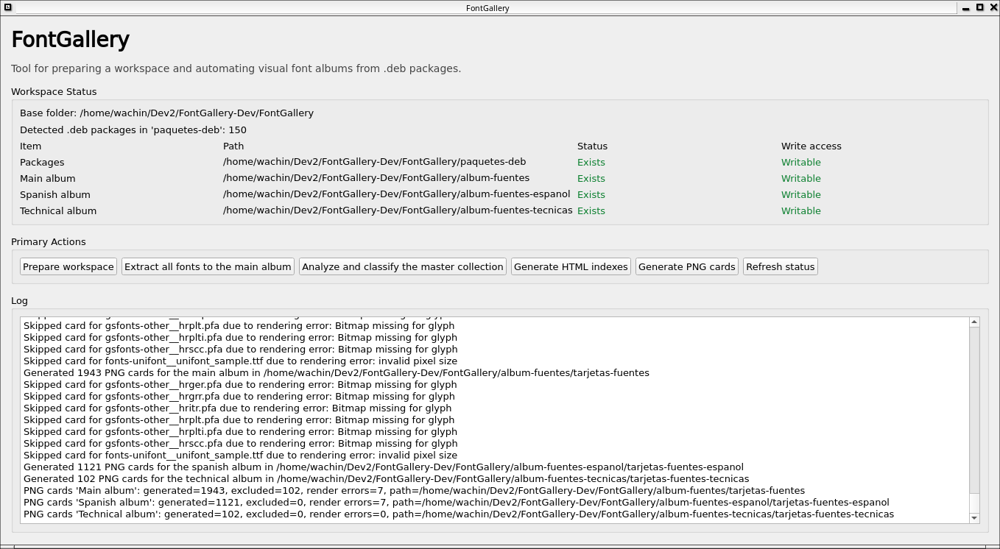

# FontGallery

[](#system-dependencies)
[](#technology)
[](#current-features)
[](#translations)
[](#tests)
[](#current-status)

`FontGallery` is a desktop application for GNU/Linux that turns `.deb` font packages into browsable visual font albums.

The project is aimed at designers, power users, and developers who want to inspect repository fonts visually instead of treating font packages as opaque archives. Its workflow extracts fonts from Debian packages, analyzes them, separates technical fonts from design-oriented fonts, and generates outputs that can be reviewed outside the application.




## Why This Project Exists

On Debian-based systems, large font collections often arrive as package files. That is useful for installation, but poor for visual review. `FontGallery` solves that gap by building a workspace where fonts can be:

- extracted once from `.deb` packages;
- analyzed for metadata and Spanish coverage;
- separated into main, Spanish, and technical collections;
- exported as HTML albums and PNG specimen cards.

## Current Features

- Desktop GUI built with `PyQt6`.
- Localized workspace naming for English and Spanish environments.
- Extraction of fonts from `.deb` packages using `dpkg-deb -x`.
- Duplicate detection by `SHA256`.
- Font metadata and charset analysis using `fc-scan`.
- Heuristic classification of technical and mathematical fonts.
- Derived Spanish-capable and technical sub-albums.
- HTML album generation for the three current collections.
- PNG card generation for the three current collections.
- Qt translation loading for English and Spanish.
- Automated tests for workspace, translations, and card generation.

## Current Status

Implemented today:

- workspace preparation;
- extraction into the master collection;
- analysis of extracted fonts;
- Spanish and technical subset derivation;
- HTML generation;
- PNG card generation;
- translation loading and translation assets;
- initial automated test coverage.

Not implemented yet:

- PDF generation from the GUI;
- background workers for long-running tasks;
- advanced designer-oriented classification filters such as serif, sans, display, or monospaced families.

## Technology

Core stack:

- `Python 3`
- `PyQt6`
- `Pillow`
- `pytest`

System tools used by the workflow:

- `dpkg-deb`
- `fc-scan`
- `pylupdate6`
- `lrelease`

## Project Layout

Important directories and files:

- `fontgallery/`: application package and services.
- `tests/`: automated tests.
- `translations/`: `.ts` and `.qm` translation assets.
- `docs/`: implementation and architecture notes.
- `main.py`: desktop entry point.
- `ROADMAP.md`: development roadmap.

## System Dependencies

For Debian 12 / MX Linux 23, install at least:

```bash
sudo apt install \
  python3-pyqt6 \
  python3-pil \
  python3-pytest \
  pyqt6-dev-tools \
  qtchooser \
  fontconfig \
  dpkg
```

What each package is used for:

- `python3-pyqt6`: GUI runtime and Qt Python bindings.
- `python3-pil`: Pillow runtime for PNG card generation.
- `python3-pytest`: test runner for the local suite.
- `pyqt6-dev-tools`: provides `pylupdate6` for translation source updates.
- `qtchooser`: provides `lrelease` in this environment.
- `fontconfig`: provides `fc-scan` for font metadata and charset analysis.
- `dpkg`: provides `dpkg-deb` for extracting `.deb` packages.

Repository reference lists:

- `packages_available_debian12_pyqt6.txt`
- `packages_available_debian12_python3.txt`

## Python Dependencies

`requirements.txt` only covers Python packages installable with `pip`.
It does not replace the GNU/Linux system dependencies required by the full workflow, such as `dpkg-deb`, `fc-scan`, `pylupdate6`, and `lrelease`.

Install the Python packages with:

```bash
pip install -r requirements.txt
```

At the moment, `requirements.txt` contains:

- `PyQt6`
- `Pillow`

On Debian-based systems, the recommended installation path for this project is still the `apt` package set shown above.

## Installation

Typical local setup:

```bash
git clone <your-repository-url>
cd FontGallery
pip install -r requirements.txt
```

If you are on Debian 12 or MX Linux 23, install the system packages first, because the full extraction and analysis workflow depends on them.

## Manual Of Use

### 1. Start from the repository root

This project currently uses `Path.cwd()` in several places, so run it from the repository root:

```bash
python3 main.py
```

### 2. Prepare the workspace

Click `Prepare workspace`.

This creates or verifies the main working folders. Depending on locale and existing workspace state, the application uses English or Spanish folder names while preserving compatibility with older Spanish workspaces.

### 3. Add `.deb` packages

Put your font packages into:

- `paquetes-deb` in a Spanish workspace
- `deb-packages` in an English workspace

### 4. Extract the master collection

Click `Extract all fonts to the main album`.

What happens:

- the app scans `.deb` files;
- filters likely font packages;
- extracts them with `dpkg-deb -x`;
- copies unique fonts into the master extracted-font directory;
- skips duplicates and broken fonts.

### 5. Analyze and classify fonts

Click `Analyze and classify the master collection`.

What happens:

- `fc-scan` reads font metadata and charset information;
- Spanish support is checked for `áéíóúüñÁÉÍÓÚÜÑ`;
- technical and mathematical fonts are detected heuristically;
- derived Spanish and technical collections are populated.

### 6. Generate HTML albums

Click `Generate HTML indexes`.

Generated outputs:

- `album-fuentes/album-fuentes.html`
- `album-fuentes-espanol/album-fuentes-espanol.html`
- `album-fuentes-tecnicas/album-fuentes-tecnicas.html`

In an English workspace the equivalent album names use English folder names.

### 7. Generate PNG cards

Click `Generate PNG cards`.

Generated outputs:

- one PNG card per font in the main album;
- one PNG card per font in the Spanish album;
- one PNG card per font in the technical album.

These cards are rendered from the locally extracted font files with `Pillow`.

## Workspace Model

Current album structure in a Spanish workspace:

- `paquetes-deb`
- `album-fuentes`
- `album-fuentes/fuentes-extraidas`
- `album-fuentes/tarjetas-fuentes`
- `album-fuentes-espanol`
- `album-fuentes-espanol/fuentes-extraidas`
- `album-fuentes-espanol/tarjetas-fuentes-espanol`
- `album-fuentes-tecnicas`
- `album-fuentes-tecnicas/fuentes-extraidas`
- `album-fuentes-tecnicas/tarjetas-fuentes-tecnicas`

Equivalent English folder names are also supported for new English-localized workspaces.

## Tests

Tests live in `tests/`.

Run them with:

```bash
env QT_QPA_PLATFORM=offscreen pytest -q
```

Current coverage includes:

- workspace naming for English and Spanish;
- reuse of an existing localized workspace;
- write-access validation for workspace paths;
- creation of extracted-font and PNG-card directories;
- translation loading;
- translation of UI and service strings;
- PNG card generation from extracted fonts.

## Translations

Translation files live in `translations/`.

Update `.ts` and `.qm` files with:

```bash
./translations/update_translations.sh
```

This uses:

- `pylupdate6`
- `lrelease`

Currently supported UI languages:

- English
- Spanish

## Architecture Summary

Service-oriented modules currently in use:

- `WorkspaceService`: workspace naming, path resolution, creation, and write checks.
- `ExtractionService`: `.deb` extraction and duplicate control.
- `AnalysisService`: metadata reading, Spanish coverage, and technical classification.
- `HtmlGenerationService`: HTML album generation.
- `CardGenerationService`: PNG card generation.

The GUI in `fontgallery/main_window.py` orchestrates those services and shows progress in its built-in log panel.

## Roadmap

Near-term priorities:

- implement PDF generation;
- add background workers to prevent GUI freezing on large jobs;
- improve classification with designer-oriented filters;
- refine exclusion and reporting logic.

See [ROADMAP.md](ROADMAP.md) for the full checklist.

## Development Notes

- Run the application from the repository root.
- Do not assume subdirectory execution.
- If you change translatable strings, rebuild the translation files.
- If you change workspace behavior, update `tests/test_workspace.py`.

## License

This repository is distributed under the terms of the license included in [LICENSE](LICENSE).
